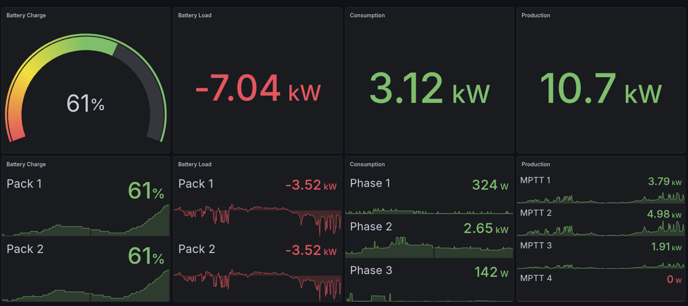
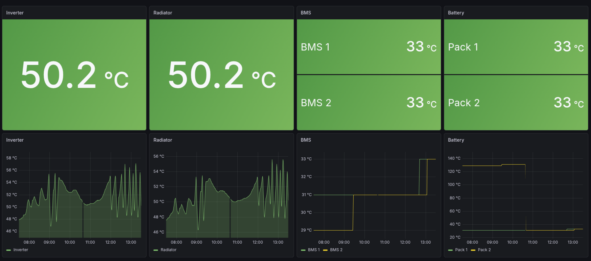
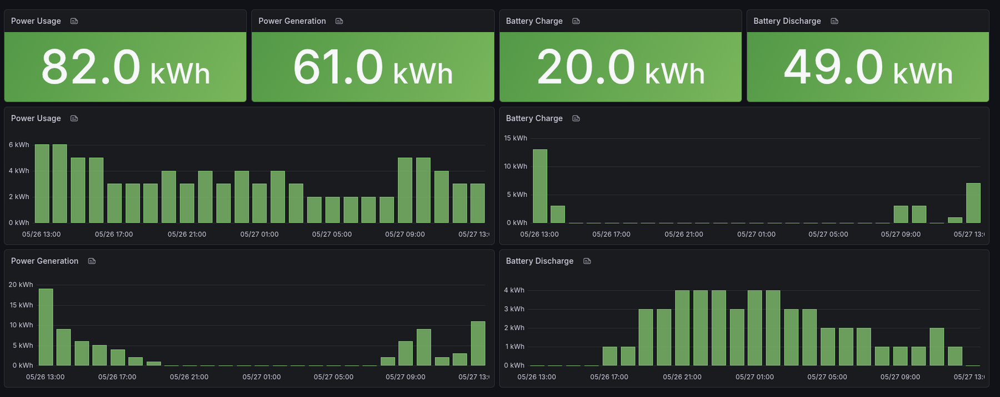
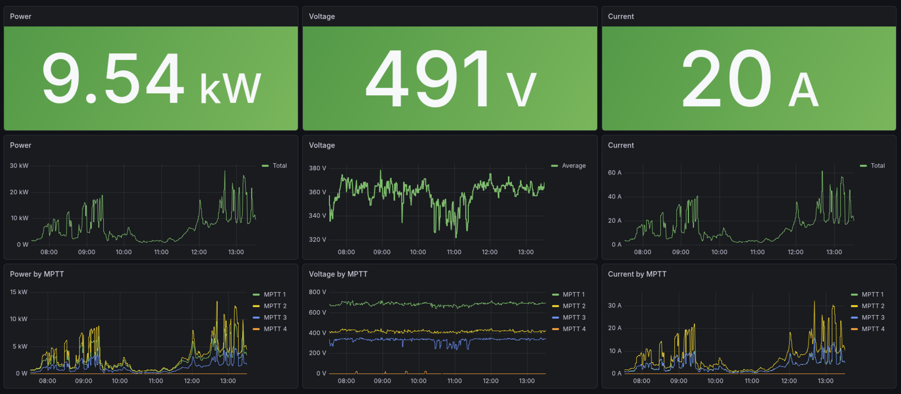
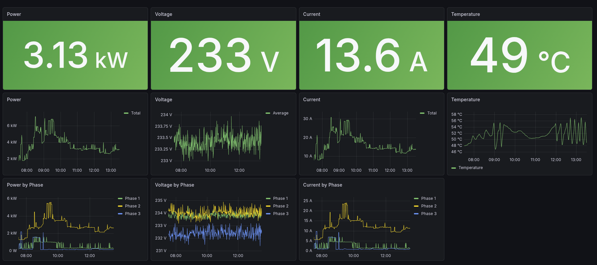
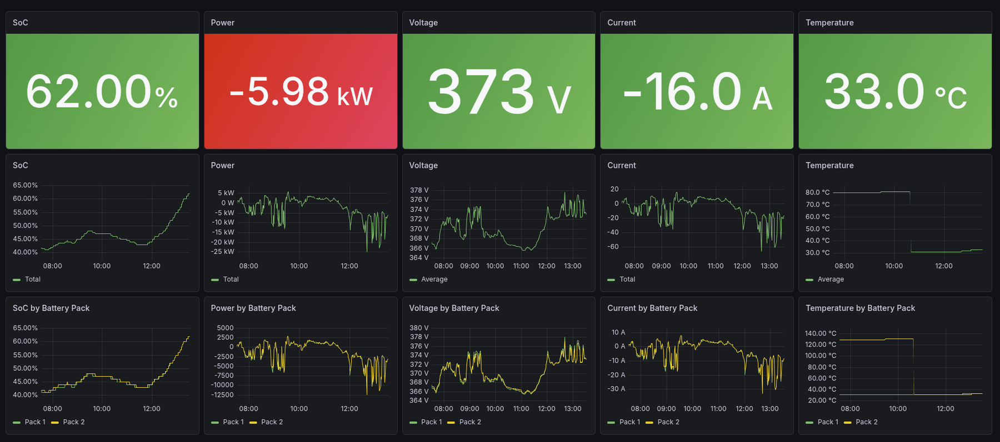
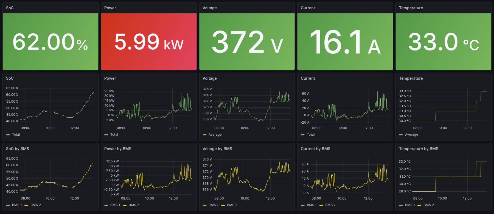

# deye-exporter  

Prometheus Exporter for Deye inverters implemented as a plugin
for [deye-inverter-mqtt](https://github.com/kbialek/deye-inverter-mqtt).

## Examples

Some example dashboards are included for ideas and for getting started.

#### Power: Overview ([overview.json](grafana/dashboards/overview.json))


#### Power: Temperature ([temperature.json](grafana/dashboards/temperature.json))


#### Power: Stats ([stats.json](grafana/dashboards/stats.json))


#### Power: Solar ([solar.json](grafana/dashboards/solar.json))


#### Power: Load ([load.json](grafana/dashboards/load.json))


#### Power: Battery ([battery.json](grafana/dashboards/battery.json))


#### Power: BMS ([bms.json](grafana/dashboards/bms.json))



## Environment

deye-exporter adds the following env variables to deye-inverter-mqtt:

| NAME                                | REQUIRED | COMMENT                           |
|-------------------------------------|----------|-----------------------------------|
| **PLUGIN_PROMETHEUS_INVERTER_NAME** | Y        | Label inverter="inverter01"       |
| **PLUGIN_PROMETHEUS_LISTEN_ADDR**   | Y        | Listen addr for /metrics endpoint |
| **PLUGIN_PROMETHEUS_LISTEN_PORT**   | Y        | Listen port for /metrics endpoint |

For a complete list of env variables
see [deye-inverter-mqtt/config.env.example](https://github.com/kbialek/deye-inverter-mqtt/blob/main/config.env.example).

## Running

### 1. deye-inverter-mqtt plugin

If adding to an existing deye-inverter-mqtt installation, then it's possible to just download the plugin from the
[releases](https://github.com/tarmolehtpuu/deye-exporter/releases) page and make sure it gets copied or mounted into /plugins directory.

**Example:**

```bash
docker run \
  -p 9010:9010 \
  -v ./plugins:/opt/deye_inverter_mqtt/plugins:ro \
  -e DEYE_LOGGER_IP_ADDRESS=10.10.10.1 \
  -e DEYE_LOGGER_PORT=8899 \
  -e DEYE_LOGGER_PROTOCOL=tcp \
  -e DEYE_LOGGER_SERIAL_NUMBER=1234567890 \
  -e DEYE_DATA_READ_INTERVAL=60 \
  -e DEYE_PUBLISH_ON_CHANGE=false \
  -e DEYE_METRIC_GROUPS=deye_sg01hp3,deye_sg01hp3_battery,deye_sg01hp3_bms,deye_sg01hp3_ups,deye_sg01hp3_generator,deye_sg01hp3_systemtime,deye_sg01hp3_settings,settings \
  -e MQTT_HOST=127.0.0.1 \
  -e DEYE_FEATURE_MQTT_PUBLISHER=false \
  -e PLUGINS_DIR=plugins \
  -e PLUGINS_ENABLED=deye_plugin_prometheus \
  -e PLUGIN_PROMETHEUS_INVERTER_NAME=inverter01 \
  -e PLUGIN_PROMETHEUS_LISTEN_ADDR=0.0.0.0 \
  -e PLUGIN_PROMETHEUS_LISTEN_PORT=9010 \
  ghcr.io/kbialek/deye-inverter-mqtt

```

### 2. deye-exporter Docker

For convenience there is also a Docker image with the plugin already preconfigured published for the following os/arch
combinations:

- **linux/amd64**
- **linux/arm64**

**Example:**

```bash
docker run \
  -p 9010:9010 \
  -e DEYE_LOGGER_IP_ADDRESS=10.10.10.1 \
  -e DEYE_LOGGER_PORT=8899 \
  -e DEYE_LOGGER_SERIAL_NUMBER=1234567890 \
  -e DEYE_METRIC_GROUPS=deye_sg01hp3,deye_sg01hp3_battery,deye_sg01hp3_bms,deye_sg01hp3_ups,deye_sg01hp3_generator,deye_sg01hp3_systemtime,deye_sg01hp3_settings,settings \
  -e PLUGIN_PROMETHEUS_INVERTER_NAME=inverter01 \
  -e PLUGIN_PROMETHEUS_LISTEN_ADDR=0.0.0.0 \
  -e PLUGIN_PROMETHEUS_LISTEN_PORT=9010 \
  ghcr.io/tarmolehtpuu/deye-exporter:0.0.12
```

## Prometheus

Add a static config for all the inverters. If running all of them on localhost then run them on separate ports so
configuring Prometheus is less of a hassle.

```yaml
- job_name: deye-exporter
  static_configs:
    - targets:
        - localhost:9010
        - localhost:9011
        - localhost:9012
        - ...
```

